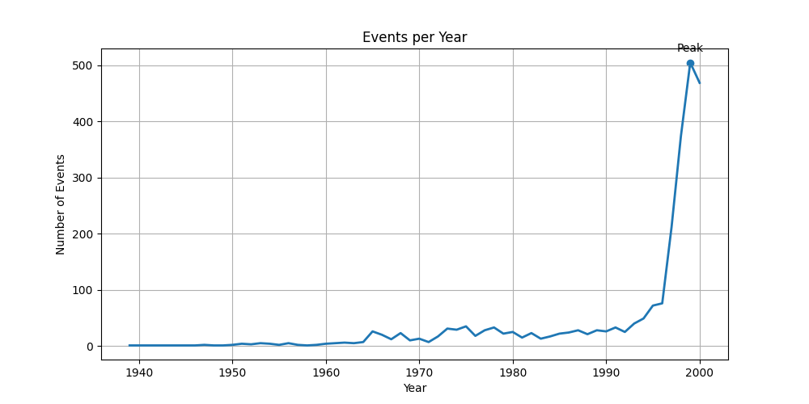

# UFO Sightings Data Analysis

## Key Insights
- Significant increase in sightings after 1995
- Peak year identified using data visualization
- Certain shapes (e.g. LIGHT, FIREBALL) dominate reports

## Tools Used
- Python
- Pandas
- Matplotlib

## Project Structure
- main.py → main analysis script
- data/data.csv → dataset

## Output
- Line chart showing UFO sightings per year
- Top cities and shapes printed in terminal

## How to Run
1.Install dependencies:
pip install pandas matplotlib

2. Run the script:
python main.py

## Sample Output

